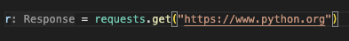
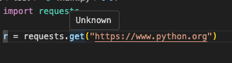
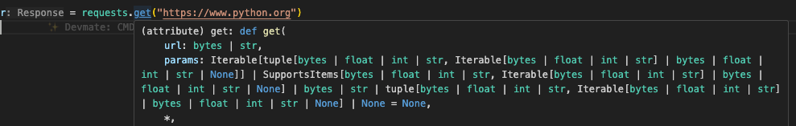

Since Pyrefly version 0.40, we've been bundling [Typeshed third party stubs](https://github.com/python/typeshed/tree/main/stubs) with every build, and since v0.46.0 we’ve been expanding beyond the stubs included with Typeshed to include stubs for select third party libraries as well. This ongoing effort brings enhancements to code navigation when using different libraries in your Python projects, and is part of our goal to make sure that the IDE experience can be used by as many people as possible. In this article, we’ll take a closer look at this feature and discuss how it can help you unlock the full potential of your IDE.

<!-- truncate -->

## What are Python stubs?

Stubs are Python files that provide type information about Python code. They can be found in files with the extension `.pyi` and define the signature of any functions, classes, etc, that are defined in the associated source file. Stubs can be very helpful for third party libraries or parts of the Python standard library that were not originally typed and allow us to use that type information to write safer code.

## Why is stub information important?

Being able to access this type information through stubs is very important during type checking. This is because it allows the type checker to verify that functions are being called with the correct argument types and that return values are being used appropriately, catching potential bugs before runtime. The inclusion of stubs also brings a lot of value to the IDE experience. The inclusion of these stubs greatly enhances certain code navigation functionality in the IDE when using these packages, as highlighted in the following examples

**Pyrefly will now provide autocomplete suggestions for types in third party libraries.**
<video
    src="/videos/stubs-autocomplete.mp4"
    width="720"
    muted
    loop
    autoPlay
    playsInline
    preload="auto"
  ></video>

**Pyrefly will now also provide inlay hints for third party libraries with included stubs.**

**Hovering on types from packages with stubs will also now show the associated type rather than 'Unknown'.**

before:

after:

## How do I ensure this is part of my IDE experience?

If you are just using Pyrefly out of the box with no custom configuration then no action is needed\! Just ensure that you are on the latest version of Pyrefly. These stubs will be bundled along with the Pyrefly installation and become active in your IDE experience.

If you are using Pyrefly with a configuration through `pyrefly.toml` or `pyproject.toml` file, we will instead prompt you to install stubs for the specified package. Due to potential version mismatches between installed packages and bundled stubs, we prefer to use stubs directly installed by the user.

## What Stubs are included?

Currently all stubs found in the [Typeshed repository](https://github.com/python/typeshed) are included.

The following stubs are also included starting with Pyrefly version 0.46

- Boto3
- Botocore
- Conans
- Matplotlib
- Pandas
- Scikit-image
- Scikit-learn
- Sympy
- Vispy

## Further Work

We have intentionally built out this support in such a way in order to very easily enable adding more stubs in the future. We invite you to share your feedback in [discord](https://discord.gg/Cf7mFQtW7W), or by opening a [GitHub issue](https://github.com/facebook/pyrefly/issues). We’d love to know how these enhancements are improving your workflow or any issues you come across. Your input will help us shape future releases and ensure Pyrefly remains a robust tool for the Python community.
